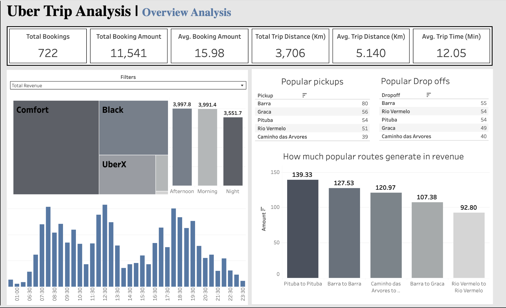
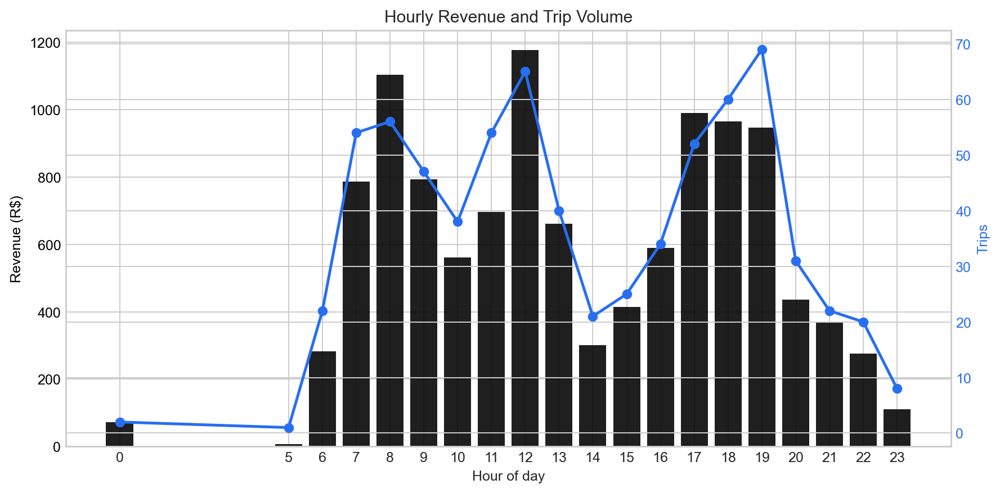
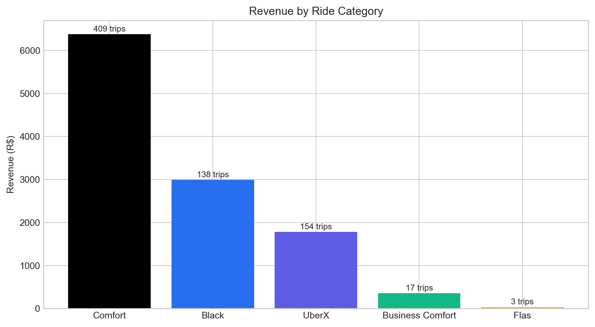
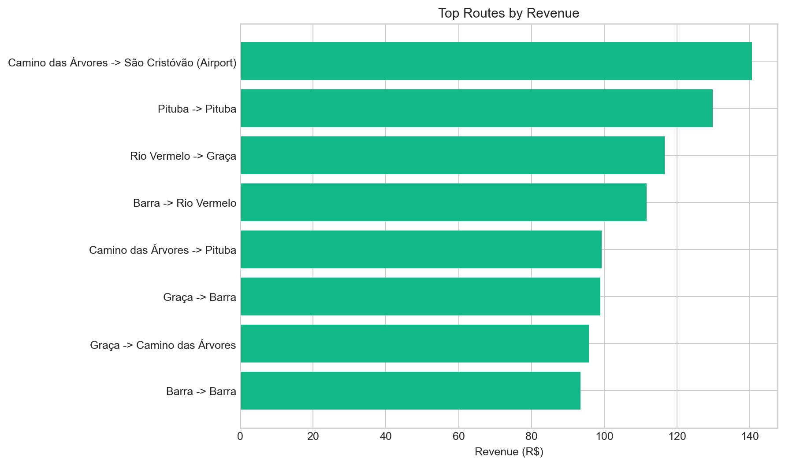

# Uber Trip Analysis Dashboard

## Overview

This repository contains a Tableau-based analysis of Uber trip activity, focused on revenue patterns, ride-category performance, route concentration, and operational efficiency. The project combines spreadsheet-based cleaning with dashboard design so the trip data can be explored visually.

This local copy is adapted from the original public repository at `https://github.com/Arunjangir8/DVA-projet-01-UBER`. The version in this workspace extends the original with refreshed documentation and additional static chart exports generated from `UBER_RAW.xlsx`.

## Objectives

- Identify the time windows that generate the strongest revenue.
- Compare the financial contribution of each ride category.
- Highlight the routes that contribute most to overall earnings.
- Present the analysis in a dashboard format that is easy to review and share.

## Project Structure

- `UBER_RAW.xlsx`: source workbook containing the raw trip and reference sheets.
- `UBER_Clean.xlsx`: cleaned workbook used for downstream analysis.
- `UBER dashboard.twb`: Tableau workbook for the interactive dashboard.
- `charts/`: dashboard screenshot plus chart exports used in this README.

## Tools Used

- Tableau for dashboard design and interactive exploration
- Excel workbooks for source and cleaned data
- Python for generating static summary charts included in this repository

## Dashboard Preview

## Added In This Version

- Reworked the project documentation to clarify scope, assets, and outputs.
- Added explicit source attribution for the original repository.
- Generated new chart images from the trip workbook for quick preview without opening Tableau.
- Summarized key metrics directly in the README for easier review.

## Dataset Snapshot

The `REAL ROUTES` sheet in `UBER_RAW.xlsx` contains 721 usable trip records after excluding incomplete rows from the exported workbook. Based on those records:

- Total revenue: `R$11,535.34`
- Average fare per trip: `R$16.00`
- Average trip distance: `5.14 km`
- Average trip duration: `12.53 min`

## Key Insights

- Trip demand is concentrated during daytime and early evening hours, where both ride volume and revenue remain consistently high.
- `Comfort` is the strongest category in this dataset by both trip count and total revenue contribution.
- Revenue is concentrated in a relatively small set of repeated routes, suggesting strong route familiarity and demand clustering.
- Static chart exports make the project easier to review quickly without needing Tableau installed.

## Key Business Questions

- Which hours combine high revenue with high trip volume?
- Which ride categories contribute most to earnings?
- Which pickup and dropoff pairs generate the strongest returns?
- How consistent is performance across seasons and neighborhoods?
- Where can time and distance be optimized without reducing revenue?

## Chart Highlights

### Revenue and Demand by Hour

This view compares hourly revenue against trip count to show when demand and earnings move together.

### Revenue by Ride Category

Comfort rides account for the largest share of the recorded trips and revenue in this dataset, with UberX and Black following behind.

### Top Routes by Revenue

The route concentration chart surfaces the pickup and dropoff pairs that contribute the most total revenue across the recorded period.

## Data Preparation Notes

- Revenue values were normalized from currency-formatted strings.
- Distance and duration fields were converted into analysis-friendly numeric values.
- Pickup and dropoff text labels were standardized to improve route-level grouping.
- Duplicate and incomplete entries were filtered before dashboarding and chart generation.

## Contribution Summary

- Refined the project documentation for clearer presentation.
- Added summary metrics and chart-based analysis to improve readability.
- Organized the repository so the dashboard and supporting visuals can be reviewed quickly.

## How To Use

1. Open `UBER dashboard.twb` in Tableau to explore the interactive dashboard.
2. Review `UBER_Clean.xlsx` and `UBER_RAW.xlsx` to inspect the underlying data.
3. Use the chart images in `charts/` for quick sharing in reports or presentations.

